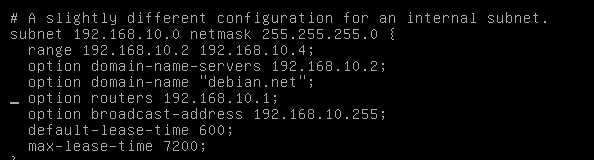
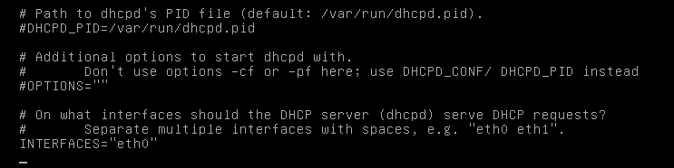
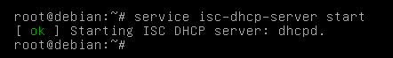

## Cara Menginstall Debian (DHCP Server)
### Menginstall DHCP Server
Install Server DHCP Dengan command:
```
sudo apt install
sudo apt install isc-dhcp-server
```
### Konfigurasi DHCP Server
Setelah sudah menginstall, Selanjutnya anda perlu mengkonfigurasi DHCP Server dengan command:
```
nano /etc/dhcp/dhcpd.conf
```
Di Dalam nano, Anda harus memasukan subnet dan Konfigurasi IP yang diberikan oleh server DHCP :
```
subnet 192.168.1.0 netmask 255.255.255.0 {
    range 192.168.10.2 192.168.10.4;
    option routers 192.168.10.1;
}
```
Hilangkan setiap tanda # dan edit bagian ip sesuai ketentuan (saya sarankan untuk meniru setinggan ip saya biar tidak bingung)

### Konfigurasi Ethernet default

Anda perlu menentukan ethernet default yang digunakan oleh server DHCP:
```
nano /etc/default/isc-dhcp-server
```

Untuk memastikan bahwa INTERFACES="eth0" 
### Restart DHCP Server
Setelah anda konfigurasi DHCP selanjutnya anda harus restart dengan perintah:
```
service isc-dhcp-server restart
```

### Nyalakan DHCP Servernya
```
service isc-dhcp-server start
```


SELAMAT MENCOBA! :)
## Selesai