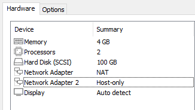

## PNETLAB
### Mengkonfigurasi PNETLAB Dengan SSH

Pertama kita membutuhkan Pnetlab menggunakan link  
[Download PNETLAB](https://www.pnetlab.com/pages/download){ .md-button }

### Setting Interface

Setelah Menginstall PNETLab, Masuk ke setting VMWare dan sesuaikan memory dan prosesor system komputer anda.  
Jika ram kalian 16 gunakan 8GB  
Jika Ram kalian 8 gunakan  4GB  
Dan setting Network adapter 1 dengan NAT dan Network Adapter 2 dengan Host-only.
Hasil settingan seperti dibawah ini:   
  

### Setting ishere2

### fix premission

### Add outer os
